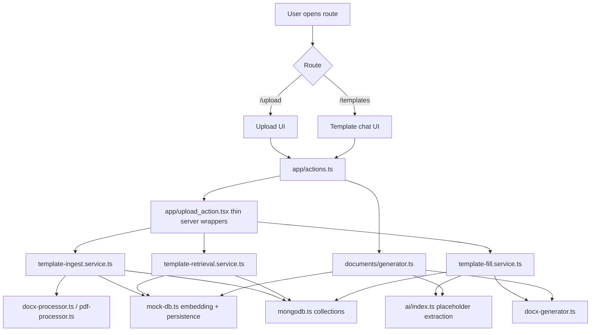
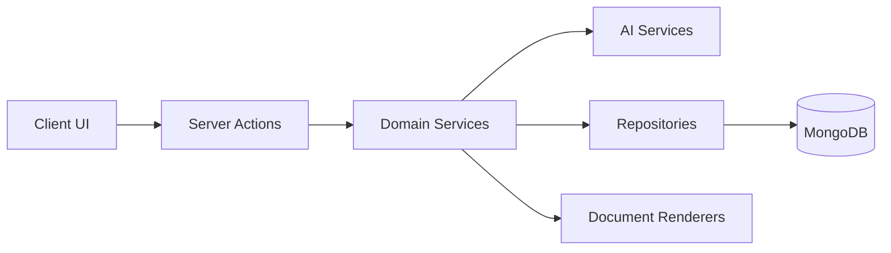

# Project Architecture

This document describes how the current application runs after the refactor, where each responsibility lives, and which file to edit for each kind of change.

## High-Level Runtime Flow

## Route Layer

- [app/page.tsx](app/page.tsx): entry screen that links to upload and template-fill workflows.
- [app/upload/page.tsx](app/upload/page.tsx): upload management page for templates.
- [app/templates/page.tsx](app/templates/page.tsx): chat-driven template retrieval and fill page.

## UI Layer

- [components/template-chat-dashboard.tsx](components/template-chat-dashboard.tsx): active template search, selection, fill, preview, and download UI.
- [lib/upload/upload_section.tsx](lib/upload/upload_section.tsx): upload widget used by the upload route.
- [Clear/ui_clear](Clear/ui_clear): legacy UI copies. Treat as reference only unless you decide to delete/archive them.

## Server Action Layer

- [app/actions.ts](app/actions.ts): public server action surface used by the client components.
- [app/upload_action.tsx](app/upload_action.tsx): thin wrappers for upload, retrieval, fill, and admin template actions.

Rule: if you need to change validation, orchestration, or which service gets called, edit [app/upload_action.tsx](app/upload_action.tsx). If you need to change business behavior, edit the service files instead.

## Service Layer

### Template ingestion

- [lib/services/template-ingest.service.ts](lib/services/template-ingest.service.ts)

Responsibilities:

- validate uploaded files
- convert `.doc` to `.docx`
- extract DOCX text and placeholders
- generate summary metadata
- create template-level embedding
- split template text into RAG chunks
- persist both template and chunk records

Change this file when you want to modify upload rules, chunking strategy, embedding payloads, or template metadata.

### Template retrieval

- [lib/services/template-retrieval.service.ts](lib/services/template-retrieval.service.ts)

Responsibilities:

- validate search input
- retrieve best matching templates from chunk-aware scoring
- return compact match payloads for the UI

Change this file when you want to tune search behavior, filters, limits, or result shaping.

### Fill sessions

- [lib/services/template-fill.service.ts](lib/services/template-fill.service.ts)

Responsibilities:

- create or continue fill sessions
- merge extracted field values across turns
- track unfilled placeholders
- render final DOCX output from template + extracted fields

Change this file when you want to alter follow-up behavior, missing-field handling, or session lifecycle.

## AI Layer

- [lib/ai/index.ts](lib/ai/index.ts)

Responsibilities:

- provider selection
- intent detection
- document extraction
- placeholder value extraction
- chat responses

Important note: this file still owns multiple AI responsibilities. It is cleaner than before because upload/retrieval/fill orchestration moved out, but the next split should be:

- `provider-registry.ts`
- `intent.service.ts`
- `placeholder-extraction.service.ts`
- `document-extraction.service.ts`

If document reasoning changes, start here.

## Persistence Layer

- [lib/mongodb.ts](lib/mongodb.ts): MongoDB models and indexes.
- [lib/db/mock-db.ts](lib/db/mock-db.ts): persistence helpers, embedding generation, similarity scoring, chunk retrieval, and save/update helpers.

Current collections:

- `DocxTemplate`: whole uploaded template record
- `DocxTemplateChunk`: chunk-level records for RAG retrieval
- `DocxTemplateMemory`: fill-session state
- `PdfDocument`: uploaded PDF record
- `GeneratedDocument`: generated output archive
- `MemoryRecord`, `SettingRecord`: app settings and saved memory

## RAG Flow

### On upload

1. User uploads a DOCX/DOC template.
2. [template-ingest.service.ts](lib/services/template-ingest.service.ts) extracts text and placeholders.
3. The service builds a template embedding for coarse ranking.
4. The service splits document text into up to 8 chunks.
5. Each chunk is saved into `DocxTemplateChunk` with its own embedding.

### On retrieval

1. User describes the template they need.
2. [template-retrieval.service.ts](lib/services/template-retrieval.service.ts) calls the retrieval helper.
3. [mock-db.ts](lib/db/mock-db.ts) computes query embedding.
4. The helper scores chunk similarity first, then merges scores back to template level.
5. Best templates are returned to the UI with score and matched chunk snippet.

### On fill

1. User selects a template.
2. User describes field values.
3. [template-fill.service.ts](lib/services/template-fill.service.ts) extracts placeholder values through [ai/index.ts](lib/ai/index.ts).
4. The fill session is saved into `DocxTemplateMemory`.
5. [docx-generator.ts](lib/documents/docx-generator.ts) renders the filled document.

## Where To Change What

- Upload validation or conversion rules: [lib/services/template-ingest.service.ts](lib/services/template-ingest.service.ts)
- Placeholder extraction behavior: [lib/processer/docx-processor.ts](lib/processer/docx-processor.ts) and [lib/ai/index.ts](lib/ai/index.ts)
- Search ranking or RAG chunk scoring: [lib/db/mock-db.ts](lib/db/mock-db.ts)
- Template chunk size/count: [lib/services/template-ingest.service.ts](lib/services/template-ingest.service.ts)
- Fill-session merge logic: [lib/services/template-fill.service.ts](lib/services/template-fill.service.ts)
- DOCX placeholder rendering: [lib/documents/docx-generator.ts](lib/documents/docx-generator.ts)
- Chat/template UI behavior: [components/template-chat-dashboard.tsx](components/template-chat-dashboard.tsx)

## Current Weak Spots

These are the next cleanup targets.

1. [lib/ai/index.ts](lib/ai/index.ts) is still too large and should be split.
2. [lib/db/mock-db.ts](lib/db/mock-db.ts) is no longer a mock database and should be renamed to something like `template-repository.ts`.
3. [Clear](Clear) contains legacy copies that increase cognitive load.
4. Both `package-lock.json` and `pnpm-lock.yaml` exist. Keep one package manager.
5. The stray folder in the repo root with the garbled Windows path name appears to be generated output and should not be treated as source.

## Target Clean Architecture

Target module split:

- UI: routes and components only
- Actions: request validation and auth only
- Services: workflow orchestration only
- AI: provider and prompt logic only
- Repositories: Mongo queries, embeddings, ranking only
- Renderers: DOCX/PDF generation only

That is the structure to preserve if you continue refactoring this codebase.
